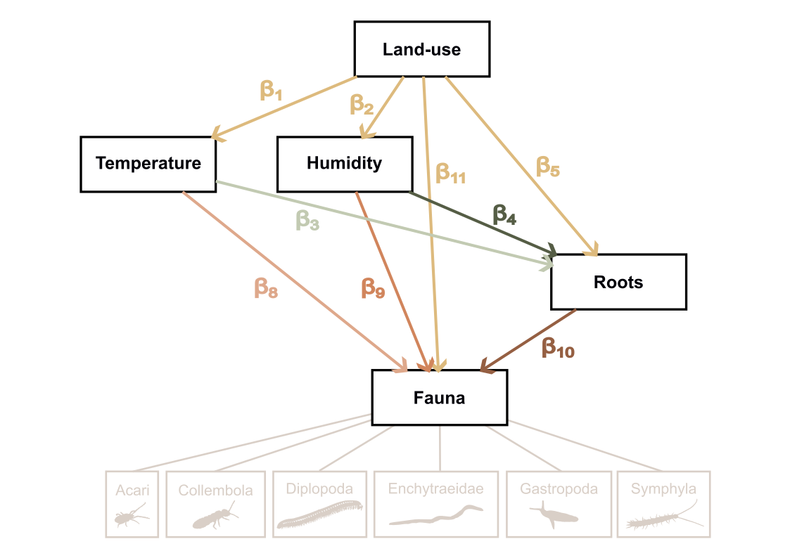

# From pixels to patterns

**High-throughput in-situ imaging unveils soil fauna dynamics in agroforestry systems**

------------------------------------------------------------------------

## Study context

Year-long scanner time series of soil invertebrate communities across two contrasted positions in an agroforestry system:

| Position | Land use  | Description                          |
|----------|-----------|--------------------------------------|
| A        | Unmanaged | Tree cover and herbaceous vegetation |
| C        | Managed   | Cultivated cover                     |

------------------------------------------------------------------------

## Research questions

**Does perennial vegetation buffer soil communities against environmental fluctuations?**

-   **H1 — Land-use effects on soil conditions.** Managed systems increase the variability and extremes of microclimate, root resource supply, and faunal abundance relative to unmanaged systems.
-   **H2 — Shift in activity drivers.** In cultivated soils, faunal activity is strongly coupled to abiotic fluctuations; under trees it is governed by internal biotic regulation.

------------------------------------------------------------------------

## Causal model (piecewise SEM)

Fitted independently on overlapping rolling time windows. All variables z-score standardised. `land_use` (0 = A, 1 = C) is the exogenous binary driver.

**Tier 1 — land use shapes microclimate**

```         
microclimate_1 ← β₁ · land_use
microclimate_2 ← β₂ · land_use
```

**Tier 2 — microclimate × land use drives root growth**

```         
root ← β₃ · mc₁ + β₄ · mc₂ + β₅ · land_use
     + β₆ · (mc₁ × land_use) + β₇ · (mc₂ × land_use)
```

**Tier 3 — microclimate + root × land use drives fauna**

```         
fauna ← β₈ · mc₁ + β₉ · mc₂ + β₁₀ · root + β₁₁ · land_use
      + β₁₂ · (mc₁ × land_use) + β₁₃ · (mc₂ × land_use)
      + β₁₄ · (root × land_use)
```

Each equation: nested random intercept `orientation / depth`, AR(1) correlation structure, residual covariance `microclimate_1 %~~% microclimate_2`.

Interaction terms yield system-specific slopes: `std_estimate` = β in A (baseline); `std_estimate_C` = β in C (main + interaction). `p_value` tests slope A ≠ 0; `interaction_p_value` tests C ≠ A.



------------------------------------------------------------------------

## Pipeline

| Script | Role | Key output |
|------------------------|------------------------|------------------------|
| `1_database_edition.qmd` | Fauna, microclimate, root, and season assembly | `SEM_database.csv` |
| `2_SEM_diagnostic.qmd` | Sensitivity analysis — window × completeness × transformation (120 combinations) | `model_parameters.txt` |
| `3_SEM_modelisation.qmd` | Full rolling-window SEM across all taxa | `SEM_results_database.csv` |
| `4_SEM_results_analysis.qmd` | Figures and tables | TIFF figures |

``` r
quarto::quarto_render("scripts/1_database_edition.qmd")
quarto::quarto_render("scripts/2_SEM_diagnostic.qmd")   # computationally intensive
quarto::quarto_render("scripts/3_SEM_modelisation.qmd")
quarto::quarto_render("scripts/4_SEM_results_analysis.qmd")
```

------------------------------------------------------------------------

## Repository structure

```         
project/
├── data/
│   ├── fauna_data.csv
│   ├── root_pixels_count.csv
│   ├── Diams_AF1W_soil.csv
│   └── Diams_AF1W_air.csv
├── output/                          # generated, not versioned
│   ├── SEM_database.csv
│   ├── SEM_results_database.csv
│   ├── model_parameters.txt
│   └── *.tiff
└── scripts/
    ├── 1_database_edition.qmd
    ├── 2_SEM_diagnostic.qmd
    ├── 3_SEM_modelisation.qmd
    └── 4_SEM_results_analysis.qmd
```
